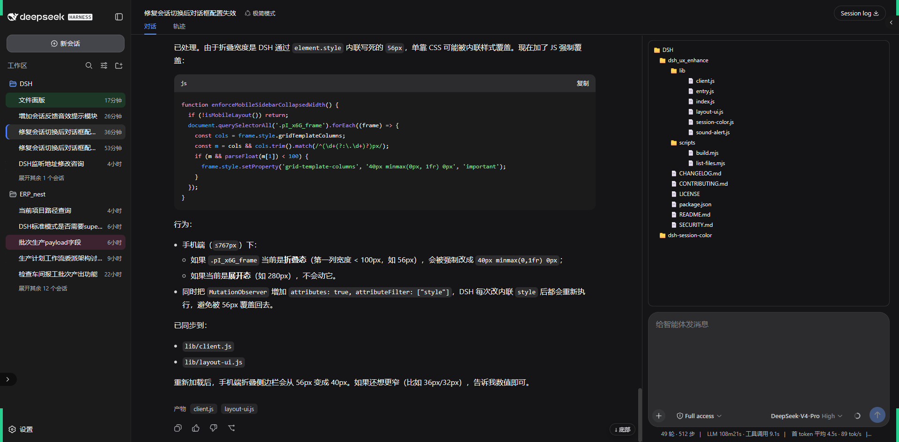
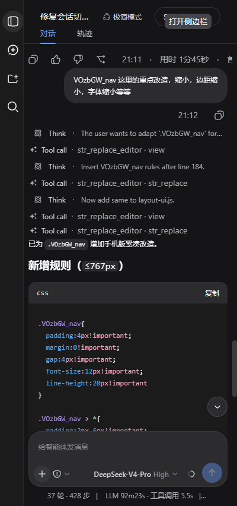
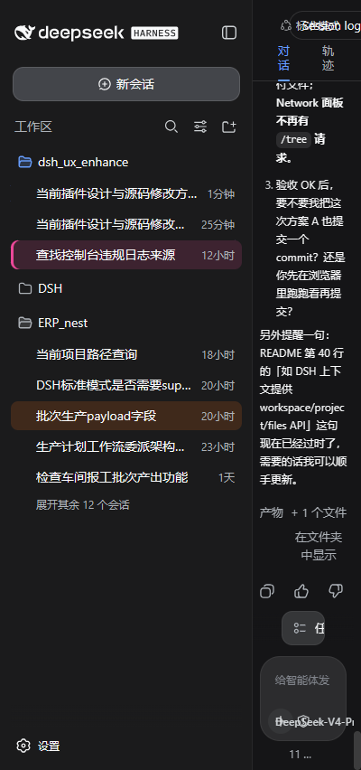

# dsh_ux_enhance

[](https://github.com/XQ-quadrant/dsh_ux_enhance/actions)
[](LICENSE)

DSH 会话界面增强插件，不改 DSH 核心，纯客户端注入。

---

## 五大核心功能

### 1. PC 版布局优化
- 加宽消息列（748px → 900px）
- 改为左右两栏布局：左侧消息流，右侧输入框 + 统计区
- 悬浮「跳到底部」按钮（`shell.overlay` 浮层槽），不丢上下文
- 工作区文件目录面板（`conversation.input.dock` 槽，输入框上方）



### 2. 手机版界面适配
- ≤767px 自动回退为原生单栏布局
- 通过 `--dshsc-mobile-*` CSS 变量缩小字号、收紧间距
- 保证手机端核心操作流畅




### 3. 会话颜色
- 会话头部动作槽（`conversation.session.header.actions`）注册色板入口
- 10 种预设色 + 清除按钮
- 颜色存入框架 `defineStore({ persist })` 会话级 store，会话删除自动清理

### 4. 音效提示
- **完成音**：`running` true → false（每轮对话跑完），上行双音「叮-咚」
- **提问音**：`pendingInteraction` 变为 `question` / `plan-review`，两声短促「叮-叮」
- Web Audio 合成，无需外部音频文件
- 可通过 `localStorage` 开关或调节音量（`dsh.soundAlert.v1`）

### 5. 工作区文件目录面板
- `conversation.input.dock` 槽组件；数据优先来自插件宿主半的同源路由
  `/ux-enhance/tree`（**含文件**、限深 5 层、跳过重目录），路由不可用时回退
  官方 `ctx.workspaces.listDirectory`（仅目录）
- **单击 / 右键**：复制相对路径（以工作区根为基准），行尾闪现「✓ 已复制」
- **双击**：目录展开/收起，文件用系统默认应用打开
- 行内「打开」按钮：在系统文件管理器中打开该文件/目录
- 手机端自动隐藏，不干扰主流程
- 注：原生 `listDirectory` 只返回目录；「含文件」目前靠宿主半 shim 实现，
  上游方案见 `docs/upstream-proposals.md` PR 2

---

## 工作原理

- 宿主半 `lib/index.js`：在 DSH webserver 上注册同源只读路由
  `GET /ux-enhance/tree?path=<cwd>`，递归列出工作区（含文件、有界），
  供浏览器半的文件树取数。
- 浏览器半 `lib/client.js`：注册为懒加载工厂包。会话颜色走官方扩展面：
  `ctx.slots.register` 把色板入口注册进会话头部动作槽（`conversation.session.header.actions`），
  颜色存于框架管理的 `defineStore({ persist })` 会话级 store；会话 id 由框架作为
  prop 直接传入，不再靠 DOM 文本反查。
- 音效模块订阅 `ctx.sessions.list`，对每个会话做状态 diff，只对**状态跳变**发声；
  开关/音量由框架 store 持久化（`dsh.soundAlert.v1`）。
- 跳底按钮注册进 `shell.overlay`（浮层槽），工作区目录树注册进
  `conversation.input.dock`（数据走 `ctx.workspaces.listDirectory`）。
- 两栏布局/手机适配仍为样式层注入（依赖构建期哈希类名，见「已知限制」）。

## 目录结构

```
dsh_ux_enhance/
├── lib/
│   ├── index.js          # 宿主半（空 apply）
│   ├── client.js         # 浏览器半 bundle（由 scripts/build.mjs 生成）
│   ├── entry.js          # 浏览器端入口，组合各功能模块
│   ├── session-color.js  # 功能1：会话颜色（会话头部动作槽 + 框架 store）
│   ├── workspace-tree.js # 功能2：工作区目录树（conversation.input.dock + listDirectory）
│   ├── layout-ui.js      # 功能3：两栏/手机 CSS 皮肤 + 跳底按钮（shell.overlay）
│   └── sound-alert.js    # 功能4：音效提示
├── scripts/
│   └── build.mjs         # node scripts/build.mjs 生成 lib/client.js
├── docs/
│   └── upstream-proposals.md  # 上游 PR 提案
└── package.json
```

> 修改源码后运行 `node scripts/build.mjs` 重新生成 `lib/client.js`，再提交。

## 安装（web profile）

以 Windows、插件放在 `D:\workspace\DSH\dsh_ux_enhance` 为例：

1. 把插件链接进 profile（`~/.dsh/profiles/web/package.json` 的 `dependencies`）：

   ```json
   {
     "dependencies": {
       "dsh_ux_enhance": "link:D:/workspace/DSH/dsh_ux_enhance"
     }
   }
   ```

2. 在 profile 的补丁层插入该插件（`~/.dsh/profiles/web/cordis.patch.yml`）：

   ```yaml
   - insert:
       - id: ux-enhance
         name: 'dsh_ux_enhance'
   ```

3. 在 profile 目录安装：

   ```powershell
   cd $env:USERPROFILE\.dsh\profiles\web
   pnpm install
   ```

4. 重启 DSH web（插件集合的变化在重启后生效）。

## 音效配置（可选）

声音开关/音量由框架 store 持久化在 `localStorage` 的 `dsh.soundAlert.v1`
（默认 `{ enabled: true, volume: 0.15 }`）。控制台直接写该键仍有效，
但 store 只在页面加载时重新读取，改动需刷新页面后生效：

```js
// 完全静音（刷新后生效）
localStorage.setItem('dsh.soundAlert.v1', JSON.stringify({ enabled: false }));

// 调小音量（0 ~ 1，默认 0.15；刷新后生效）
localStorage.setItem('dsh.soundAlert.v1', JSON.stringify({ volume: 0.08 }));

// 恢复默认（删除该键，下次加载回到默认）
localStorage.removeItem('dsh.soundAlert.v1');
```

## 已知限制

- 布局优化依赖构建期哈希类名（`wSkVaW_*` 等），DSH 升级后可能需要更新
- 会话颜色的侧边栏行染色暂未实现：侧边栏会话行没有公开的 per-row 槽、
  DOM 上也没有 `data-session-id`，需上游在 `dsh-client-ui-workspace` 暴露
  （加 `data-session-id` 属性或 `session.row` 槽）；当前颜色入口在会话头部
- 工作区文件树仅显示目录层级（宿主 `listDirectory` 不返回文件）；显示文件
  需上游扩展
- 颜色和音效设置存于浏览器 `localStorage`，不跨设备同步

> 上述「需上游」的两点已整理成具体的 PR 提案，见
> [docs/upstream-proposals.md](docs/upstream-proposals.md)。

## License

MIT © XQ-quadrant
